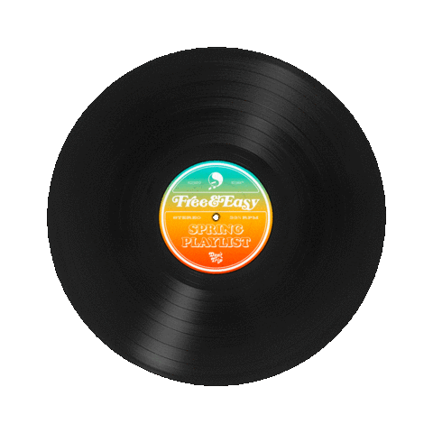

<!-- Header -->

  
   
   

<!-- Nav Buttons -->

  
  

<!-- Title -->

  

<h1> TL/DR </h3>
<ul>
  <li>🥇 Proficient in Node.js, React, TypeScript, AWS and SQL for web development.</li>
  <li>🥈 Experienced with Docker, Terraform, CI/CD pipelines, and BASH scripting for DevOps.</li>
  <li>🥉 Skilled in UI/UX design principles and practices, with experience as a Scrum Master for Agile project management.</li>
  <li>🗣️💬 I'm always eager to engage in discussions about the principles of clean code, optimal code structure, and robust architecture.</li>
  <li>🏎️ The surest path to achieving speed is by ensuring that things are done well from the start.</li>
</ul>

<h2> More about me :)</h2>

🧗‍♂️ Not just scaling code but rock walls too – I'm an avid climber, both in the digital realm and on actual mountains. Tackling challenges, whether it's a complex coding problem or a challenging boulder, fuels my passion for growth and achievement.  
☕ Brewing code and coffee – While my keyboard clacks away, I'm also a coffee aficionado who brews specialty blends during coding breaks. 
 
👥 Team player extraordinaire – As a former team leader chosen by my peers in University, I know the rhythm of collaboration. I take pride in fostering an environment where teammates not only work together but also thrive together.

---

<ul>
        <li>Experienced in a variety of web technologies (<a href="https://www.gethero.pl">React</a>, <a href="https://www.gethero.pl">Gatsby</a>, <a href="https://flotiq.com/starters/">GraphQL</a>, <a href="https://github.com/DominikIlski/DominikIlski/blob/main/at-work-nda-protected">Nest.js</a>, <a href="https://github.com/DominikIlski/DominikIlski/blob/main/at-work-nda-protected">Node.js</a>,<a href="https://github.com/DominikIlski/Flutter_ChatGPT">Flutter</a>)</li>
        <li>Worked on projects for the British NHS</li>
        <li>Skilled in handling complex data structures</li>
        <li>Proficient in API development and management</li>
        <li>Experience with performance testing and cloud deployment using <a href="https://github.com/DominikIlski/CDNs_perormance_testing">Terraform</a> and <a href="https://github.com/DominikIlski/CDNs_perormance_testing">Docker</a></li>
        <li>Proven expertise in architecture design for web applications</li>
        <li>Agile project management experience</li>
        <li>Excellent soft skills, including communication, teamwork, and problem-solving</li>
        <li>Constantly working on improving with clean code and TDD</li>
    </ul>

<h1>What drives me</h1>

<svg width="100%" height="352"   xmlns="http://www.w3.org/2000/svg">
<svg width="100%" height="352" xmlns="http://www.w3.org/2000/svg">
  <foreignObject width="100%" height="352">
    

      <iframe
        src="https://open.spotify.com/embed/playlist/0wsV2HC80NqZuieuxlr3bJ?utm_source=generator&theme=0"
        style="border-radius: 12px"
        width="100%"
        height="352"
        frameBorder="0"
        allowfullscreen=""
        allow="autoplay; clipboard-write; encrypted-media; fullscreen; picture-in-picture"
        loading="lazy"
      ></iframe>
    

  </foreignObject>
</svg>

 
 

  

 
 

  

---

<!-- Footer -->

  

  

<!-- 

    

 -->

